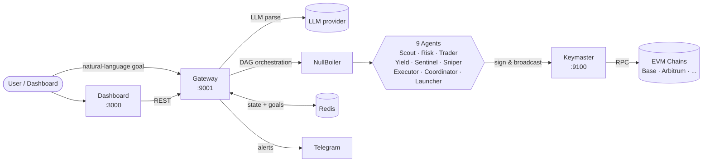

# Vespra

**A self-hosted DeFi agent swarm that turns plain-English goals into autonomous on-chain execution.**

[](#)
[](./LICENSE)
[](https://www.rust-lang.org)
[](#)
[](#roadmap)

---

## What is Vespra?

Vespra is a free and open-source DeFi agent swarm that turns natural-language goals
(*"compound 1 ETH on Base at the best yield, exit if drawdown exceeds 5%"*) into
autonomous on-chain execution. It runs nine specialized agents
(**Scout, Risk, Trader, Yield, Sentinel, Sniper, Executor, Coordinator, Launcher**)
orchestrated through a DAG across multiple EVM chains. Self-hosted, no middleman, no
fees by default.

## Quick Setup

```bash
git clone https://github.com/kingl0w/Vespra.git
cd Vespra
./scripts/init.sh      # one-time config
make up                # start the stack
./scripts/doctor.sh    # verify everything is running
```

Submit your first goal:

```bash
curl -X POST http://localhost:9001/goals \
  -H 'Content-Type: application/json' \
  -d '{"raw_goal":"Earn yield on 0.01 ETH on base_sepolia","wallet_label":"my-first-wallet"}'
```

---

## Architecture



| Component | Role | Port |
|---|---|---|
| **Gateway** (`gateway-rs`) | HTTP API, agent orchestration, goal lifecycle | 9001 |
| **Keymaster** | Encrypted burner-wallet vault + signing service | 9100 |
| **Redis** | Goal state, rate counters, kill-switch mirror | 6379 |
| **Dashboard** | Web UI (nginx + SPA) | 3000 |
| **NullBoiler** | DAG workflow scheduler *(optional)* | 9090 |

Only Keymaster holds keys. The gateway can request a signature, but cannot exfiltrate
a key — and if the kill switch is active, Keymaster refuses every signing request
regardless of what the gateway says.

---

## Features

- **Natural-language goals** — parsed by an LLM into a structured plan (capital, target, stop-loss, chain, strategy)
- **Multi-chain, concurrent goals** — run several on Base, Arbitrum, and their testnets in parallel
- **Sentinel monitoring** — a background loop wakes every 5 minutes to check gain/stop-loss on every open position
- **Yield rotation** — the yield scheduler rotates capital between pools when APY deltas exceed a configurable threshold
- **On-chain sniper** — detects new pool launches and enters with a configurable cap
- **Auto-resume** — on gateway restart, running/paused goals pick up where they left off
- **Telegram notifications** — lifecycle events, failures, kill-switch transitions
- **Keymaster-enforced kill switch** — signing disabled regardless of gateway state
- **Encrypted burner wallets** — AES-256-GCM at rest, decrypted only in-memory on sign
- **Optional fee model** — off by default, off in the repo, no hardcoded treasury
- **Fully self-hostable** — one `docker compose up`, no SaaS, no shared backend

---

## Prerequisites

- **Docker** + **Docker Compose** v2+
- **At least one EVM RPC endpoint** — free public RPCs work for testnets (Base Sepolia, Arbitrum Sepolia); for mainnet use [Alchemy](https://alchemy.com), [Infura](https://infura.io), or [QuickNode](https://quicknode.com)
- **LLM API key** — Anthropic, OpenAI, DeepSeek, Groq, or any OpenAI-compatible endpoint. Can also run self-hosted [Ollama](https://ollama.ai) with no key
- **(Optional)** A Telegram bot for notifications — create with [@BotFather](https://t.me/BotFather)
- **(Optional)** [Cloudflare Tunnel](https://developers.cloudflare.com/cloudflare-one/connections/connect-networks/) for remote dashboard access

---

## First-Goal Walkthrough

Assuming the stack is up and `doctor.sh` shows all green:

### 1. Create a burner wallet

```bash
source .env
curl -X POST http://localhost:9100/wallets \
  -H "Authorization: Bearer $KEYMASTER_BEARER_TOKEN" \
  -H 'Content-Type: application/json' \
  -d '{"chain":"base_sepolia","label":"alpha","cap_eth":"0.05"}'
```

The response contains the wallet's `address` and `wallet_id`. The private key never
leaves Keymaster.

### 2. Fund it from a testnet faucet

- Base Sepolia: https://www.alchemy.com/faucets/base-sepolia
- Arbitrum Sepolia: https://www.alchemy.com/faucets/arbitrum-sepolia

Send ~0.01 ETH to the wallet address from step 1.

### 3. Submit a goal

```bash
curl -X POST http://localhost:9001/goals \
  -H 'Content-Type: application/json' \
  -d '{
    "raw_goal":"Earn yield on 0.005 ETH on base_sepolia, exit if down 5%",
    "wallet_label":"alpha"
  }'
```

The gateway parses the goal with the LLM, scouts for opportunities, runs the risk gate,
decides on entry, calls Keymaster to sign, and transitions the goal through
`SCOUTING → RISK → TRADING → EXECUTING → MONITORING`.

### 4. Watch it work

```bash
# tail gateway logs
docker compose logs -f gateway

# or via the dashboard
open http://localhost:3000
```

### 5. Check Telegram

If you configured `VESPRA_TELEGRAM_BOT_TOKEN` + `VESPRA_TELEGRAM_CHAT_ID`, you'll get
messages on every lifecycle transition — goal created, entered, exited, stopped out.

---

## Configuration Reference

All config is driven by a single `.env` at the repo root. Generate it with
`./scripts/init.sh`; every var below comes from `.env.example`.

### Network

| Var | Default | Required | Description |
|---|---|---|---|
| `VESPRA_NETWORK_MODE` | `testnet` | yes | `testnet` (relaxed risk, synthetic fallback) or `mainnet` (strict, real data only) |

### Chains

| Var | Default | Required | Description |
|---|---|---|---|
| `RPC_URL_BASE_SEPOLIA` | `https://sepolia.base.org` | testnet | Base Sepolia RPC |
| `RPC_URL_ARBITRUM_SEPOLIA` | `https://sepolia-rollup.arbitrum.io/rpc` | testnet | Arbitrum Sepolia RPC |
| `RPC_URL_BASE` | *(unset)* | mainnet | Base mainnet RPC |
| `RPC_URL_ARBITRUM` | *(unset)* | mainnet | Arbitrum One RPC |

### Keymaster

| Var | Default | Required | Description |
|---|---|---|---|
| `KEYMASTER_MASTER_PASSWORD` | *(generated)* | yes | Unlocks the encrypted keystore. Min 16 chars. **Losing this means losing access to wallets.** |
| `KEYMASTER_BEARER_TOKEN` | *(generated)* | yes | Bearer token for authenticated Keymaster endpoints. Min 16 chars. |

### Gateway

| Var | Default | Required | Description |
|---|---|---|---|
| `VESPRA_REDIS_URL` | `redis://redis:6379` | yes | Redis connection string |
| `VESPRA_KEYMASTER_URL` | `http://keymaster:9100` | yes | Keymaster URL the gateway posts signing requests to |
| `VESPRA_AUTO_RESUME_GOALS` | `true` | no | On boot, resume running/paused goals from Redis |
| `VESPRA_MAX_TX_PER_HOUR` | `100` | no | Gateway-wide rate limit on executor calls |
| `VESPRA_MAX_GLOBAL_WALLET_VALUE_ETH` | *(unset)* | no | Global cap across all burner wallets. Unset = no cap |
| `VESPRA_DRY_RUN` | `false` | no | Set `true` to skip all Keymaster broadcasts (simulation mode) |

### Notifications (optional)

| Var | Default | Required | Description |
|---|---|---|---|
| `VESPRA_TELEGRAM_BOT_TOKEN` | *(unset)* | no | Bot token from @BotFather |
| `VESPRA_TELEGRAM_CHAT_ID` | *(unset)* | no | Chat ID to send messages to |

### LLM

| Var | Default | Required | Description |
|---|---|---|---|
| `VESPRA_LLM_PROVIDER` | `anthropic` | yes | One of `anthropic`, `openai`, `deepseek`, `groq`, `ollama`, `custom` |
| `VESPRA_LLM_API_KEY` | *(unset)* | yes (no for `ollama`) | API key for the chosen provider |
| `VESPRA_LLM_MODEL` | `claude-sonnet-4-6` | yes | Model identifier (see defaults per provider below) |
| `VESPRA_LLM_BASE_URL` | *(unset)* | required for `custom`, optional for `ollama` | OpenAI-compatible endpoint |

#### Supported LLM providers

| Provider | Default model | Base URL | Key required |
|---|---|---|---|
| `anthropic` | `claude-sonnet-4-6` | built-in | yes |
| `openai` | `gpt-4o` | built-in | yes |
| `deepseek` | `deepseek-chat` | `https://api.deepseek.com` | yes |
| `groq` | `llama-3.3-70b-versatile` | `https://api.groq.com/openai/v1` | yes |
| `ollama` | `llama3.1:8b` | `http://localhost:11434/v1` | no (local) |
| `custom` | *(you specify)* | *(you specify)* | yes |

Any OpenAI-compatible endpoint works via `custom`. `./scripts/init.sh` will walk you
through the picker and write the right defaults.

### Fees (optional, off by default)

| Var | Default | Required | Description |
|---|---|---|---|
| `FEES_ENABLED` | `false` | no | Enable performance + AUM fees |
| `TREASURY_ADDRESS` | *(unset)* | if `FEES_ENABLED=true` | Address that receives fee sweeps |

---

## Testnet → Mainnet Transition

**Do not skip any of these steps.** Real funds, real chain, no takebacks.

### 1. Create and fund a mainnet burner wallet

Start small — ≤ 0.1 ETH for your first run. Set a wallet `cap_eth` so Keymaster refuses
to send more than that per transaction:

```bash
curl -X POST http://localhost:9100/wallets \
  -H "Authorization: Bearer $KEYMASTER_BEARER_TOKEN" \
  -H 'Content-Type: application/json' \
  -d '{"chain":"base","label":"mainnet-alpha","cap_eth":"0.05"}'
```

### 2. Swap RPC URLs in `.env`

```env
RPC_URL_BASE=https://base-mainnet.g.alchemy.com/v2/<KEY>
RPC_URL_ARBITRUM=https://arb-mainnet.g.alchemy.com/v2/<KEY>
```

### 3. Flip the network mode

```env
VESPRA_NETWORK_MODE=mainnet
```

This disables the synthetic WETH/USDC fallback, tightens the risk gate (MEDIUM risk
becomes a hard reject), and disables the trader's testnet momentum bypass.

### 4. (Optional) Enable fees

Only relevant if you're running a managed tier for others. For personal use, leave off.

```env
FEES_ENABLED=true
TREASURY_ADDRESS=0xYourSafeAddress
```

### 5. (Recommended) Set a global cap

```env
VESPRA_MAX_GLOBAL_WALLET_VALUE_ETH=0.5
```

Rejects new goals at creation time if the sum of every wallet balance plus the goal's
capital would exceed this cap.

### 6. Restart and test small

```bash
make restart
./scripts/doctor.sh
```

Submit a tiny goal first:

```bash
curl -X POST http://localhost:9001/goals \
  -H 'Content-Type: application/json' \
  -d '{"raw_goal":"Compound 0.001 ETH on Base, exit at 3% gain or -2% loss","wallet_label":"mainnet-alpha"}'
```

Watch it closely for the first few runs. If anything looks off, hit the kill switch:

```bash
curl -X POST http://localhost:9001/swarm/kill
```

---

## Troubleshooting

### "telegram notifications disabled"
Expected if you didn't set `VESPRA_TELEGRAM_BOT_TOKEN` or `VESPRA_TELEGRAM_CHAT_ID`.
Safe to ignore — everything else runs fine without it.

### "no opportunities" on mainnet
Low-liquidity window or the scout couldn't find a pool matching your goal. Wait and
retry, loosen the strategy (lower `min_tvl_usd`), or pick a more liquid chain.

### Keymaster returns 503: "kill switch active — signing disabled"
The kill switch is on. Deactivate:

```bash
curl -X POST http://localhost:9001/swarm/resume
# or directly on keymaster:
curl -X POST http://localhost:9100/kill-switch/deactivate \
  -H "Authorization: Bearer $KEYMASTER_BEARER_TOKEN"
```

### Gateway won't start / Redis connection failed
The gateway requires Redis. Make sure `VESPRA_REDIS_URL` resolves:

```bash
docker compose ps redis
docker compose logs gateway | grep -i redis
```

If running outside Docker, `redis://redis:6379` won't resolve — use
`redis://127.0.0.1:6379`.

### `docker compose build` fails on Rust services
Cargo caching can be stale. Rebuild clean:

```bash
make reset    # wipes volumes too — only on first-time setup!
make build
```

### Wallet cap exceeded
Keymaster refuses sends that exceed the wallet's `cap_eth`. Raise it:

```bash
curl -X PUT http://localhost:9100/wallets/<wallet_id>/cap \
  -H "Authorization: Bearer $KEYMASTER_BEARER_TOKEN" \
  -H 'Content-Type: application/json' \
  -d '{"cap_eth":"0.2"}'
```

---

## Optional Fees

Fees are **off by default** and there is **no treasury wallet in the repo**. If you're
running Vespra for yourself, leave `FEES_ENABLED=false` and you pay nothing beyond
gas + DEX fees.

If you're running a managed tier for others and want to collect a performance fee, set:

```env
FEES_ENABLED=true
TREASURY_ADDRESS=0xYourOwnTreasury
```

Current fee schedule when enabled:

- **Performance fee:** 5% of realized profit, swept on exit
- **AUM fee:** 0.5% annualized, swept weekly
- Both have a dust threshold (0.0001 ETH) below which sweeps are skipped

Keymaster enforces `TREASURY_ADDRESS` is a valid checksum address at boot — no fees
fire without it.

---

## Security Model

- **Burner wallets are encrypted at rest** with AES-256-GCM, derived from
  `KEYMASTER_MASTER_PASSWORD` via Argon2id. Keys are decrypted in-memory only when a
  signing request lands.
- **Keymaster enforces the kill switch.** The flag is persisted to disk at
  `/opt/vespra-keymaster/kill-switch.state` and re-loaded on restart. A compromised
  gateway **cannot** drain wallets if the kill switch is on — every signing route
  returns 503.
- **Bearer auth on all Keymaster write endpoints.** No write call goes through without
  `Authorization: Bearer $KEYMASTER_BEARER_TOKEN`.
- **Per-wallet spend caps** and **gateway-wide TX rate limits** prevent runaway
  execution — a misbehaving LLM can't drain a wallet faster than `max_tx_per_hour`.
- **Global wallet cap** (optional) rejects new goals if total custody would exceed the
  configured limit.
- **Dry-run mode** (`VESPRA_DRY_RUN=true`) runs the full pipeline without touching
  Keymaster — useful for a first pass.

**Vespra has not been externally audited.** Known limitations:

- LLM hallucinations can produce invalid swap parameters; the pipeline validates, but
  the surface area is large
- Keymaster and gateway share a host by default — co-location reduces the kill-switch
  guarantee in practice
- Chain-level MEV is not defended against
- Off-chain price oracles can lag or be wrong; stop-loss relies on them

Report security issues privately via a GitHub security advisory on this repo.

---

## Roadmap

### Done
- Multi-chain goal lifecycle (SCOUTING → RISK → TRADING → EXECUTING → MONITORING → EXIT)
- Nine specialized agents backed by the LLM provider of your choice
- Keymaster with encrypted keystore, kill switch, per-wallet caps
- Redis-backed auto-resume
- Telegram notifications
- Network-mode flag (testnet/mainnet) gating synthetic fallback + risk relaxations
- Global cap + per-hour TX rate limits
- Docker Compose stack with `make up` / `./scripts/doctor.sh`

### Next
- Additional chain adapters (Optimism, Polygon zkEVM)
- On-chain fee sweeper with Safe multisig support
- Dashboard goal editor (currently read-only)
- Per-goal spend cap (not just per-wallet)
- Agent response caching for cheaper cycles

### Not in scope
- Custodial mode
- Cross-chain bridging as a first-class goal primitive
- Non-EVM chains
- **Mainnet-audit-ready claim.** This is beta software. Run with money you can afford
  to lose.

---

## Contributing

Issues and PRs welcome.

- **Bug reports:** open a GitHub issue with reproduction steps, `docker compose logs`,
  and the redacted `.env` you booted with
- **Feature requests:** issue first — discuss scope before opening a PR
- **PRs:** feature branch → PR against `main`. CI must pass; add tests for new
  behavior. Match the existing Rust formatting (`cargo fmt`) and keep comments
  minimal (code should be self-explanatory)
- **Security issues:** use GitHub security advisories, not public issues

---

## License

MIT — see [LICENSE](./LICENSE). Do whatever you want, just don't blame me.

---

## Disclaimer

Vespra interacts with real funds on real blockchains. You are responsible for any
losses you incur. **Always test on testnet first.** This is not financial advice.
The software has not been audited. Past results don't predict future returns. Keep
backups of your `.env` (specifically `KEYMASTER_MASTER_PASSWORD`) — lose that file and
you lose access to every wallet the Keymaster created.

Run with money you can afford to lose.
